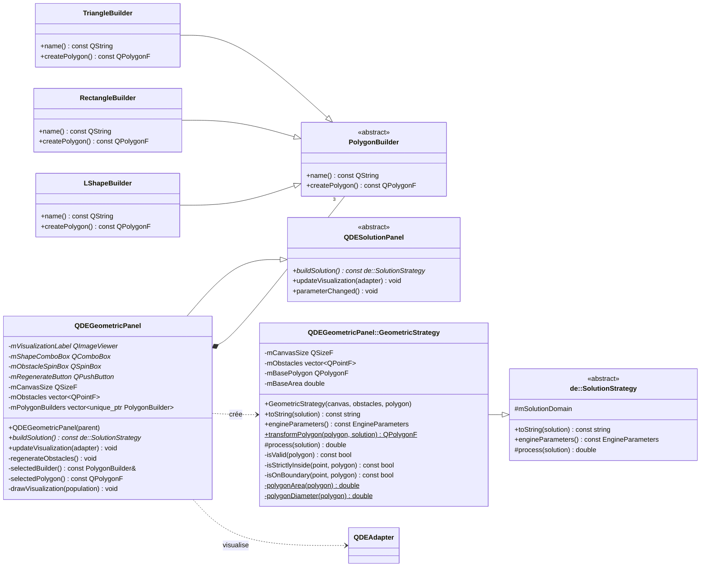

# Rapport de conception — Optimisation géométrique

## Choix de conception

Le problème est représenté par un panneau graphique et une stratégie de résolution, comme dans `QDEOpenBoxPanel`.

- `QDEGeometricPanel` configure le problème et dessine la population.
- `QDEGeometricPanel::GeometricStrategy` définit le domaine et la fonction objective.
- `PolygonBuilder` fournit l'interface commune servant à créer les formes.
- `TriangleBuilder`, `RectangleBuilder` et `LShapeBuilder` créent les trois formes offertes.

`buildSolution()` transmet à la stratégie une copie du canevas, des obstacles et du polygone sélectionné. Ces données ne changent donc pas pendant l'évolution.

## Formes retenues

Les formes sont définies autour de l'origine. Elles conservent ainsi leurs proportions pendant la mise à l'échelle.

| Forme | Créateur | Sommets |
|---|---|---|
| Triangle | `TriangleBuilder` | `(-0.5, 0.5)`, `(0, -0.5)`, `(0.5, 0.5)` |
| Rectangle | `RectangleBuilder` | `(-0.5, -0.35)`, `(0.5, -0.35)`, `(0.5, 0.35)`, `(-0.5, 0.35)` |
| Forme en L | `LShapeBuilder` | `(-0.5, -0.5)`, `(-0.1, -0.5)`, `(-0.1, 0.1)`, `(0.5, 0.1)`, `(0.5, 0.5)`, `(-0.5, 0.5)` |

Le triangle et le rectangle sont deux cas convexes simples. La forme en L vérifie aussi le comportement avec un polygone concave.

## Diagramme de classes UML



Le panneau possède les trois créateurs par `std::unique_ptr<PolygonBuilder>`. La sélection d'une forme utilise donc réellement l'interface abstraite, sans logique géométrique dans le panneau.

## Domaine et fonction objective

Une solution contient quatre valeurs :

| Indice | Valeur | Domaine |
|---:|---|---|
| 0 | Position `x` | `[0, largeur]` |
| 1 | Position `y` | `[0, hauteur]` |
| 2 | Rotation | `[0°, 360°]` |
| 3 | Échelle | `[0, diagonale du canevas / diamètre du polygone]` |

La borne d'échelle est sûre : une forme dont le diamètre dépasse la diagonale du canevas ne peut pas y entrer. La transformation applique l'échelle, la rotation, puis la translation avec `QTransform`.

Une solution est invalide si son rectangle englobant sort du canevas ou si un obstacle est strictement à l'intérieur du polygone. Le contact avec le canevas ou un obstacle reste permis. Un test séparé du contour, avec une petite tolérance, évite de rejeter ces contacts.

La fonction objective à maximiser est directe :

```text
solution valide   : aireInitiale × échelle²
solution invalide : 0
```

La stratégie utilise `de::OptimizationMaximization` et `de::FitnessIdentity`, comme le problème de la boîte ouverte.

Les paramètres recommandés sont une population de `60` solutions et `400` générations, ce qui reste raisonnable pour un problème à quatre dimensions.

## Interface et visualisation

Le panneau offre une liste de formes, le nombre d'obstacles et un bouton pour régénérer leur position. Le canevas conserve une taille fixe de `800 × 600`. Les obstacles sont générés avant la simulation et copiés dans la stratégie.

La visualisation montre le canevas, les obstacles, toute la population en gris et le meilleur candidat en bleu. Les paramètres du panneau sont déjà désactivés pendant l'évolution par les connexions de l'application principale.

## Organisation des fichiers

La norme GPA434 demande un duo de fichiers par classe :

```text
PolygonBuilder.h/.cpp
TriangleBuilder.h/.cpp
RectangleBuilder.h/.cpp
LShapeBuilder.h/.cpp
QDEGeometricPanel.h/.cpp
```

`GeometricStrategy` reste imbriquée dans `QDEGeometricPanel`, suivant la structure de `QDEOpenBoxPanel::OpenBoxStrategy`.
