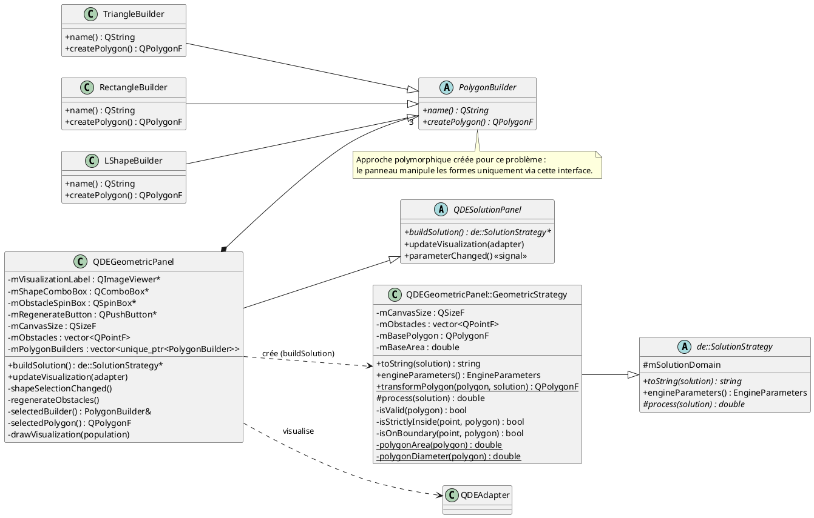
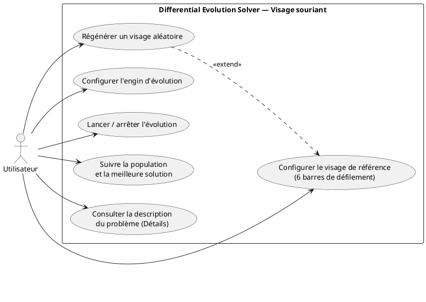
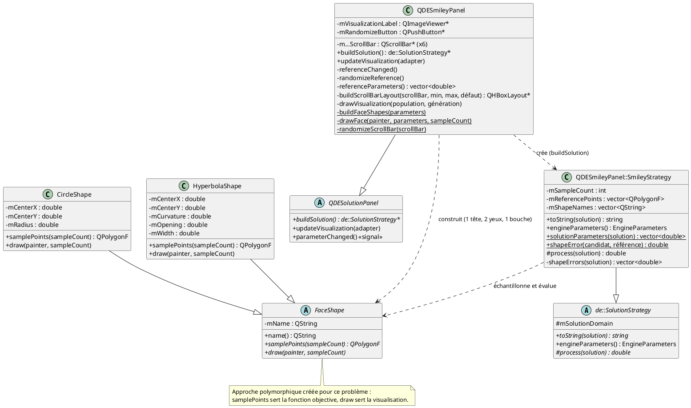

# GPA434 — Ingénierie des systèmes orientés-objet

## Laboratoire 3 — Application graphique liée à l'évolution différentielle

Équipe :

- Frederic Tchouanguep (TCHF12028409)
- Ahmed Sadek (SADA63290301)
- Paul Ayoub (AYOP28099900)

Date : 2026/08/13

---

# Problème 1 — Optimisation géométrique

## Diagramme de classes UML



Le panneau possède les trois créateurs par `std::unique_ptr<PolygonBuilder>`. La sélection d'une forme utilise donc réellement l'interface abstraite, sans logique géométrique dans le panneau.

## Domaine et fonction objective

Une solution contient quatre valeurs :

| Indice | Valeur | Domaine |
|---:|---|---|
| 0 | Position `x` | `[0, largeur]` |
| 1 | Position `y` | `[0, hauteur]` |
| 2 | Rotation | `[0°, 360°]` |
| 3 | Échelle | `[0, diagonale du canevas / diamètre du polygone]` |

La borne d'échelle est sûre : une forme dont le diamètre dépasse la diagonale du canevas ne peut pas y entrer. La transformation applique l'échelle, la rotation, puis la translation avec `QTransform`.

Une solution est invalide si son rectangle englobant sort du canevas ou si un obstacle est strictement à l'intérieur du polygone. Le contact avec le canevas ou un obstacle reste permis. Un test séparé du contour, avec une petite tolérance, évite de rejeter ces contacts.

La fonction objective à maximiser est directe :

```text
solution valide   : aireInitiale × échelle²
solution invalide : 0
```

La stratégie utilise `de::OptimizationMaximization` et `de::FitnessIdentity`, comme le problème de la boîte ouverte.

Les paramètres recommandés sont une population de `60` solutions et `400` générations, ce qui reste raisonnable pour un problème à quatre dimensions. Le facteur de mutation `f = 0.25` et le taux de croisement `R = 0.75` sont ceux qui ont donné la meilleure convergence lors de nos essais.

---

# Problème 2 — Visage souriant (sujet ouvert)

## Présentation technique du problème

Le problème consiste à retrouver, par évolution différentielle, les paramètres
d'un visage souriant correspondant exactement à un visage de référence affiché
à l'écran. Le visage est décrit par quatre traits paramétriques :

- la tête, un cercle (centre `x`, `y` et rayon `r`);
- l'œil gauche et l'œil droit, deux cercles indépendants (`x`, `y`, `r` chacun);
- la bouche, une branche d'hyperbole centrée sur son sommet
  `y(x) = k − a·(√(1 + ((x − h) / b)²) − 1)`, définie par sa position (`h`, `k`),
  sa courbure `a`, son ouverture `b` et sa largeur échantillonnée `w`.

Une solution regroupe donc `3 × 3 + 5 = 14` valeurs réelles. L'algorithme ne
voit jamais le dessin : il ne manipule que ces 14 nombres. La correspondance
visuelle émerge de la fonction objective.

Intrants (fixés avant la résolution, six éléments de paramétrisation) :

| Élément | Rôle |
|---|---|
| Rayon de la tête | Taille du visage de référence |
| Rayon des yeux | Taille des yeux de référence |
| Écartement des yeux | Distance entre les deux yeux |
| Courbure de la bouche | Paramètre `a` de l'hyperbole de référence |
| Largeur de la bouche | Paramètre `w` de l'hyperbole de référence |
| Ouverture de la bouche | Paramètre `b` de l'hyperbole de référence |

Les six éléments décrivent tous le visage de référence : chaque dimension de
la solution correspond ainsi à une valeur que l'usager peut réellement
influencer. Le nombre de points comparés par trait est une constante du
panneau. Un bouton `Régénérer un visage` tire aléatoirement les six éléments,
produisant un nouveau visage de référence à retrouver.

Extrants :

- la meilleure solution : les 14 paramètres reconstruits, présentés avec
  l'erreur totale et l'erreur par trait (`toString`);
- la visualisation : le visage de référence à gauche, toute la population à
  droite (rognée aux limites de son canevas), la meilleure solution mise en
  évidence, ainsi qu'une ligne d'information sous le canevas de droite donnant
  l'erreur totale de la meilleure solution et la génération courante.

## Domaine et fonction objective

Une solution contient quatorze valeurs :

| Indices | Trait | Valeurs | Domaine |
|---:|---|---|---|
| 0 – 2 | Tête | `x`, `y`, `r` | `[0, 400]`, `[0, 400]`, `[10, 200]` |
| 3 – 5 | Œil gauche | `x`, `y`, `r` | `[0, 400]`, `[0, 400]`, `[2, 60]` |
| 6 – 8 | Œil droit | `x`, `y`, `r` | `[0, 400]`, `[0, 400]`, `[2, 60]` |
| 9 – 13 | Bouche | `h`, `k`, `a`, `b`, `w` | `[0, 400]`, `[0, 400]`, `[1, 100]`, `[5, 200]`, `[20, 300]` |

Justification du domaine : les positions couvrent exactement le canevas de
`400 × 400`. Les bornes des rayons et des paramètres de la bouche englobent
toutes les valeurs que le panneau peut donner au visage de référence (avec une
marge), tout en excluant les cas dégénérés (rayon nul, ouverture nulle).

La fonction objective échantillonne `n` points sur chaque trait, dans le même
ordre pour le candidat et pour la référence, puis calcule :

```text
erreur(s) = somme sur les 4 traits de :
    (1/n) · somme des ||point_i(candidat) − point_i(référence)||²
```

C'est une **minimisation** (`de::OptimizationMinimization`,
`de::FitnessIdentity`) : une erreur nulle signifie que le candidat reproduit
exactement la référence. Justifications :

- la distance quadratique pénalise fortement les traits éloignés et produit un
  gradient de recherche régulier vers la référence;
- la moyenne par trait rend l'erreur indépendante du nombre de points
  d'échantillonnage (une constante du panneau, fixée à 32);
- l'échantillonnage dans un ordre déterministe (angle initial fixe pour les
  cercles, balayage gauche-droite pour la bouche) garantit que deux traits
  identiques donnent une erreur exactement nulle;
- une solution hors domaine reçoit une erreur constante très élevée.

Les paramètres recommandés sont une population de `100` solutions et `800`
générations : l'espace à quatorze dimensions est nettement plus vaste que
celui des problèmes précédents. Le facteur de mutation `f = 0.35` et le taux
de croisement `R = 0.80` sont ceux qui ont donné la meilleure convergence lors
de nos essais.

## Diagramme de cas d'utilisation UML



## Diagramme de classes UML


